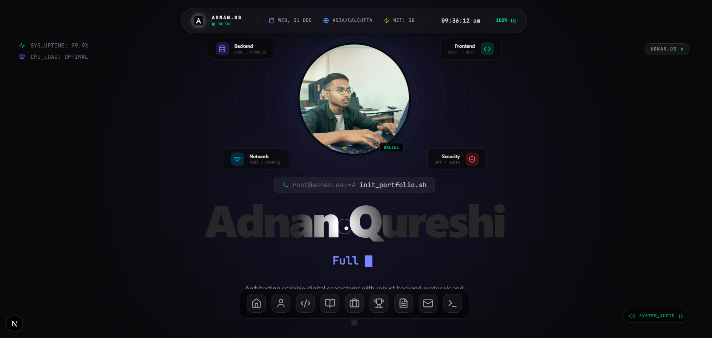

# Adnan.OS ➜ v3.0 // System Online



## 🟢 System Status: Nominal

**Adnan.OS** is not just a portfolio; it's a high-performance, interactive digital experience designed to mimic a futuristic Operating System. Built with **Next.js 15**, **Tailwind CSS v4**, and **MongoDB**, it features a fully immersive UI with biometric scanning effects, ambient audio, and command-line aesthetics.

### 🚀 Live Demo
[**Adnan.OS**](https://adnanos.vercel.app/)

---

## ⚡ Core Architecture

This project moves away from traditional web design patterns, utilizing advanced motion libraries and state management to create a "living" interface.

### 🎨 Visual & Interactive Features
* **Futuristic Hero Section:** 3D orbital animations, "Biometric" profile scanner, and a text spotlight reveal effect.
* **Immersive Audio:** Toggleable sci-fi ambient background sound with visualizer bars.
* **System Animations:** Complex entry animations using **GSAP** and **Framer Motion** for a smooth, "boot-up" feel.
* **Dynamic Data:** Real-time fetching of Projects, Blogs ("System Logs"), and Achievements ("Execution History") from MongoDB.
* **Responsive Design:** Fully optimized "Mobile Dashboard" experience.

### 🛠 Tech Stack

**Frontend Engine:**
*  **App Router** for server-side rendering.
*  for type-safe architecture.
*  for utility-first styling.
* **Geist Font Family** (Vercel) for that precise, technical typography.

**Animation & UX:**
* **GSAP (GreenSock):** Complex timelines and scroll triggers.
* **Framer Motion:** Spring physics for cards and lists.
* **Typed.js:** Terminal typing effects.
* **Lucide React:** consistent, lightweight icon set.

**Backend & Data:**
*  **Mongoose** for schema-based data modeling.
* **Cloudinary** for high-performance image optimization and hosting.
* **Server Actions** for secure data mutation (Admin Panel).

---

## 📂 System Modules (Features)

1.  **The Command Center (Hero):**
    * Interactive parallax mouse movement.
    * Real-time system clock and status indicators.
    * Spotlight masking effect on the main title.

2.  **Dev Chronicles (Blog System):**
    * Dynamic routing (`/blog/[slug]`).
    * Markdown rendering support.
    * Fallback "Empty State" handling.

3.  **Execution History (Achievements):**
    * Framer Motion "Spring" entrance animations.
    * Tap-to-reveal interactions for mobile devices.
    * Holographic hover effects.

4.  **Secure Transmission (Contact):**
    * Bento Grid layout for social links.
    * Copy-to-clipboard functionality for email.

5.  **Admin Dashboard (Secure):**
    * Protected route for content management.
    * Real-time statistics (active projects, blog counts, system health).
    * "Quick Add" functionality for new assets.

---

## 💾 Installation Protocols

Follow these steps to deploy the system locally.

### 1. Clone the Repository
```bash
git clone [https://github.com/adnan-commit/Adnan.OS](https://github.com/adnan-commit/Adnan.OS)
```

### 2. Clone the Repository
```bash
npm install
```

### 3. Environment Configuration
Create a .env file in the root directory and add your secret keys:
```bash
# Database Connection
MONGODB_URI=<your database url>

# JWT Secret
JWT_SECRET=<jwt secret key>

# cloudinary 
NEXT_PUBLIC_CLOUDINARY_CLOUD_NAME=<cloudinary cloud name>
CLOUDINARY_API_KEY=<Cloudinary api key>
CLOUDINARY_API_SECRET=<Cloudinary api secret>
```

### 4. Initialize System (Run Local)
```bash
npm run dev
```
Open http://localhost:3000 to view the interface.


## 🚀 Deployment

*  **This system is optimized for Vercel.**
    * Push code to GitHub.
    * Import project to Vercel.
    * Add the Environment Variables (from step 3) in Vercel settings.
    * **Deploy.**


## 📜 License
MIT License © 2025 Adnan Qureshi

**System Shutting Down...**

---